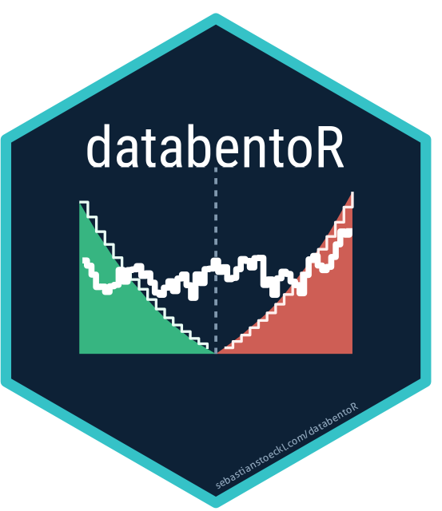

<!-- README.md is generated from README.Rmd. Please edit that file -->

# databentoR 

<!-- badges: start -->

[](https://github.com/sstoeckl/databentoR/actions/workflows/check.yaml)
[](https://github.com/sstoeckl/databentoR/actions/workflows/equivalence.yaml)
[](https://lifecycle.r-lib.org/articles/stages.html#experimental)
<!-- badges: end -->

A complete R client for the [Databento](https://databento.com) market
data HTTP API. Databento publishes clients for Python, C++ and Rust but
not for R; this fills that gap, and does it without requiring Python or
the binary DBN format.

Everything the HTTP API offers is covered: dataset and schema discovery,
free cost and record-count previews, streaming range downloads,
symbology resolution, asynchronous batch jobs, and the reference data
endpoints for corporate actions, adjustment factors and the security
master. Argument names, defaults and the bytes on the wire mirror the
official Python client, so a script translates line by line. Results
come back as tibbles, or go straight to parquet.

## Installation

``` r
# install.packages("pak")
pak::pak("sstoeckl/databentoR")
```

## Authentication

The key lives in an environment variable and nowhere else.

    setx DATABENTO_API_KEY "db-XXXX..."     # Windows, then open a new session
    export DATABENTO_API_KEY="db-XXXX..."   # macOS and Linux, in ~/.profile

## Usage

``` r
library(databentoR)

db_list_datasets()
db_list_schemas("GLBX.MDP3")

# how far back does each schema actually go?
db_get_dataset_range("OPRA.PILLAR")

args <- list(dataset = "GLBX.MDP3", start = "2024-01-02", end = "2024-01-09",
             symbols = "ES.FUT", schema = "ohlcv-1d", stype_in = "parent")

# previews are free; the download is billed per gigabyte
do.call(db_get_cost, args)           # US dollars
do.call(db_get_record_count, args)   # rows you would get

es <- do.call(db_get_range, args)    # a tibble
```

`vignette("databentoR")` walks through the rest: symbology, batch jobs,
reference data, and exact nanosecond timestamps.

## Why the types are never guessed

Column types are assigned from the field name rather than inferred. That
is not fussiness: a `trades` slice whose `action` column happens to be
all `"T"` infers as boolean, which would silently turn every trade
action into `TRUE`. `db_field_types()` reports what databentoR will
assign, and the live test suite checks that table against
`db_list_fields()`.

Timestamps come back as `POSIXct`, which stores seconds as a double and
so resolves to about a quarter of a microsecond on modern dates. Pass
`ts_type = "integer64"` when you need the exact nanosecond count. Fields
that are 64-bit on the wire are never downcast either, so `order_id` and
an undefined statistics `quantity` keep their value.

Row order is the server’s own, and the server does not promise a stable
order among records sharing a timestamp: two downloads of one slice can
return the same rows in a different sequence. Sort if you need
reproducibility.

## Equivalence with the Python client

The official client is pinned as a git submodule, and agreement with it
is a test rather than a claim.

- **Wire equivalence**, offline and free, on every push. A stub
  transport records the exact request the pinned Python client would
  send for all 28 endpoints; the suite asserts that databentoR builds
  the same method, endpoint, and parameter names, values and order. It
  also checks the R value domains against the compiled DBN enums, so a
  schema added upstream fails the tests instead of a user’s request.
- **Data equivalence**, weekly and billed in cents. Six tiny slices are
  frozen through the Python client and compared column by column: prices
  to a relative tolerance of `1e-12`, timestamps and counts exactly.
- **Upstream watch**, weekly. When a new Python release appears, the
  wire fixture is re-captured against it and the diff is filed as an
  issue naming the calls that changed.

The one deliberate divergence is `timeseries.get_range`, where
databentoR asks for the CSV encoding instead of DBN.
`vignette("equivalence")` documents that and the five remaining
differences.

**Downloaded market data is never committed.** Databento’s licence does
not permit redistribution, so the reference fixtures stay untracked.

## Not included

Live streaming. The live gateway speaks binary DBN over TCP with a
challenge-response handshake, which needs a DBN decoder; this package is
built on the text encodings precisely to avoid one.

## License

MIT © Sebastian Stöckl. Not affiliated with or endorsed by Databento.
